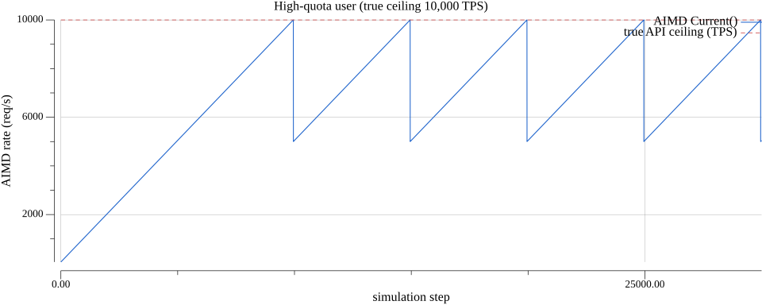
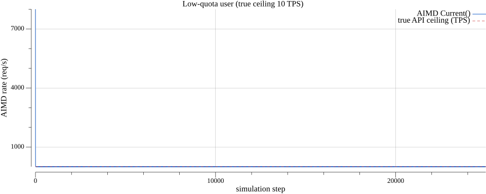
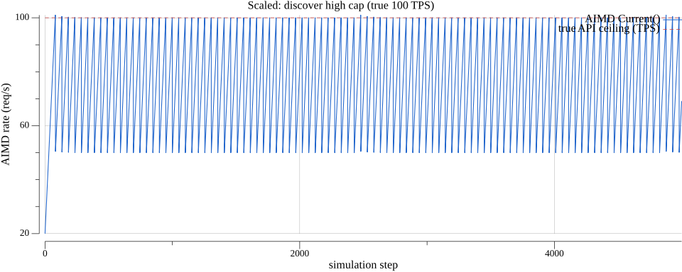
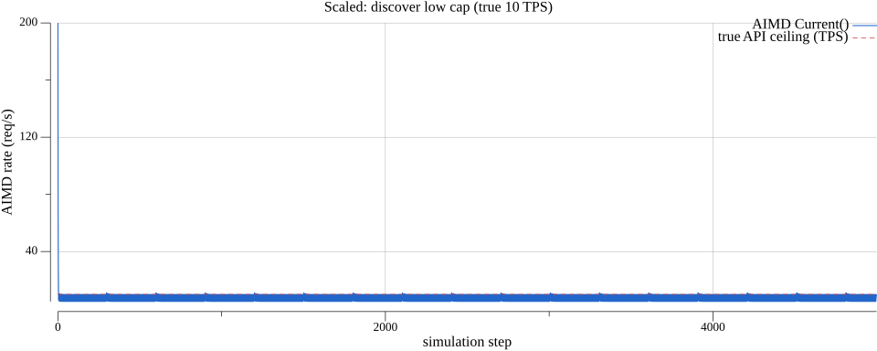

# AIMD hidden-capacity scenarios

This note matches the **simulation model** in [`aimd_scenario_test.go`](../../aimd_scenario_test.go) at the repository root: each **step**, the client compares its AIMD **`Current()`** rate to a **hidden** API ceiling. If `Current() > trueTPS`, the API returns 429 → **`Backoff()`**; otherwise the request succeeds → **`OnSuccess()`** (with the same fake-clock tuning as the unit tests: 1 ms between additive steps, backoff merge disabled for deterministic stepping).

That model abstracts “I don’t know whether this caller is allowed 10 TPS or 10,000 TPS” into something observable: **throttle vs success**. Production APIs add token buckets, bursts, and concurrency; this is a **qualitative** picture of how jorb’s AIMD behaves.

## High-quota user (10,000 TPS ceiling), conservative start

**Parameters:** true ceiling **10,000 TPS**, AIMD **initial 50**, **min 1**, **max 15,000**, **30,000** steps.



The series **ramps up** from the conservative initial rate: each successful step adds **+1 req/s** (subject to the increase interval in real configs). Once `Current()` crosses the true ceiling, 429s drive **×0.5** backoffs, so you see a **sawtooth**: climb, drop, climb again. The **red dashed line** is the unknown true cap; the **blue** curve is what AIMD “thinks” the safe rate is. Late in the run, the average level sits **near the ceiling** even though any single snapshot can be mid-sawtooth (e.g. just after a backoff).

**Takeaway:** If most users are low-cap but **you** are high-cap, starting **low** avoids hammering the API while AIMD **discovers** headroom and stabilizes **under** your configured **max** (here 15,000).

## Low-quota user (10 TPS ceiling), aggressive start

**Parameters:** true ceiling **10 TPS**, AIMD **initial 8,000**, **min 1**, **max 20,000**, **25,000** steps.



The first moves are dominated by **multiplicative decrease**: 8,000 → 4,000 → … until requests succeed without 429. The limiter then **hunts** around the true cap with the same **+1 / ×0.5** pattern, so the steady band is a **small band** above and below **10 TPS** (still bounded by **min**).

**Takeaway:** If you **overestimate** a tenant’s quota, AIMD **pulls down** quickly at first (halving steps), then fine-tunes upward only as fast as additive increase allows. That matches “we started too high; the API told us to back off.”

## Scaled scenarios (faster to simulate and test)

Same logic with smaller numbers so CI stays cheap: **100 TPS** vs **10 TPS** ceilings, **5,000** steps, **max 500**.

### Discover high cap (true 100 TPS)



### Discover low cap (true 10 TPS)



**Takeaway:** The **shape** matches the 10k/10 cases: **up-and-sawtooth** when the cap is high relative to the start, **down-and-sawtooth** when the cap is low.

## Regenerating the charts

`gencharts` is a small **nested Go module** (so the main `jorb` module does not pick up Gonum). Run it from that directory:

```sh
cd examples/aimd/gencharts && go run .
```

Optional first argument: output directory (default: `../charts` when your working directory is `gencharts`). The code is under [`examples/aimd/gencharts`](gencharts/) and uses [Gonum Plot](https://gonum.org/v1/plot/) to render PNGs.

## Related code

- **Tests:** [`aimd_scenario_test.go`](../../aimd_scenario_test.go) — `TestAIMD_UnknownCap_*`
- **Limiter:** [`ratelimit.go`](../../ratelimit.go) — `AIMDRateLimiter`, `Backoff`, `OnSuccess`
- **Processor wiring:** [`processor_test.go`](../../processor_test.go) — `TestProcessor_AIMDBackoff`, `TestProcessor_AIMDWithMultipleJobs`
